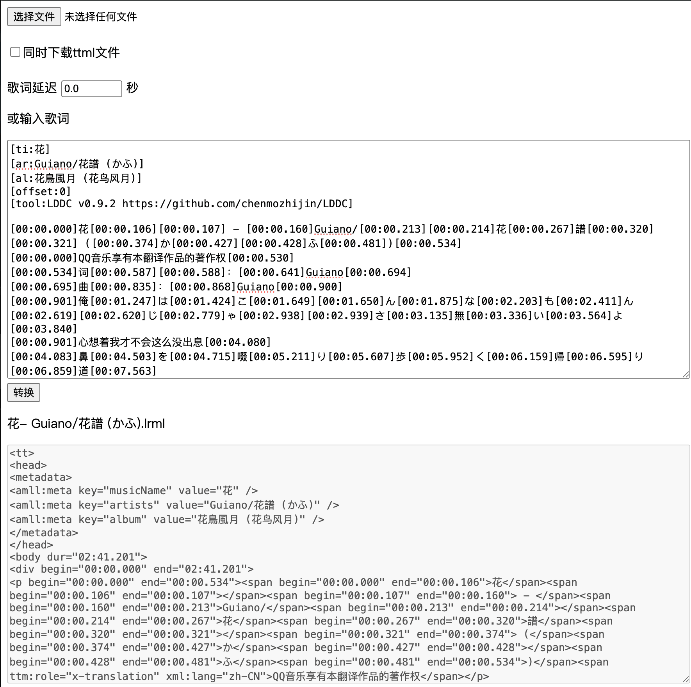

# LRC-to-TTML
逐字LRC歌词转TTML

## 仅支持以下的两种格式，分别是不带翻译、和带中文翻译的类型
[00:00.901]俺[00:01.247]は[00:01.424]こ[00:01.649][00:01.650]ん[00:01.875]な[00:02.203]も[00:02.411]ん[00:02.619][00:02.620]じ[00:02.779]ゃ[00:02.938][00:02.939]さ[00:03.135]無[00:03.336]い[00:03.564]よ[00:03.840]

[00:30.880]あ[00:32.117]ー[00:33.354] [00:34.591]星[00:34.939]に[00:35.204]だ[00:35.423][00:35.424]っ[00:35.643]て[00:35.944]
[00:30.880]啊—— 甚至想要向着星星[00:35.940]

如果需要ttml格式的文件，请勾选`同时下载ttml文件`选项，下面转换出来的预览框中的是ttml+lrc

